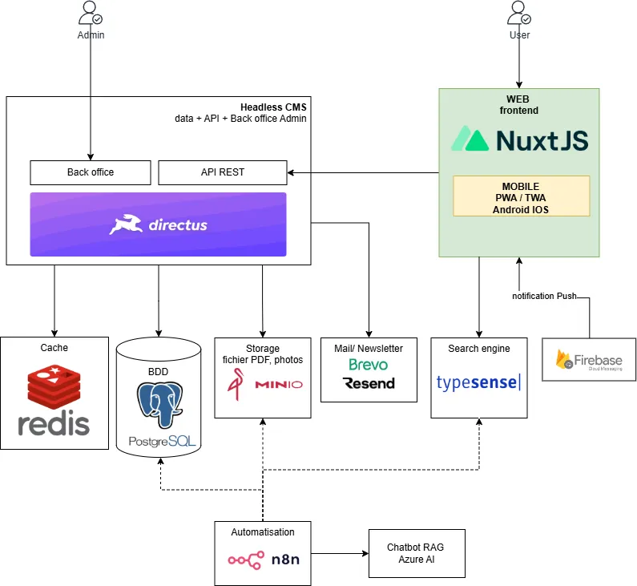

# Vie Publique Sénégal

[](https://github.com/vie-publique-senegal/vie-publique.sn/actions)
[](https://sonarcloud.io/summary/new_code?id=malicktech_vie-publique.sn)
[](https://www.gnu.org/licenses/gpl-3.0)
[](https://nuxt.com)
[](https://github.com/sponsors/vie-publique-senegal)
[](https://github.com/vie-publique-senegal/vie-publique.sn/stargazers)

> Originally initiated within [Code for Senegal](https://github.com/Code-for-Senegal/vie-publique.sn) and now actively maintained by [Vie Publique Sénégal](https://github.com/vie-publique-senegal/vie-publique.sn).

## Overview

Vie Publique Sénégal is a platform dedicated to providing transparent access to public information in Senegal. This project aims to make government data and public information easily accessible to citizens.

## Features

- **News Section**: Access to the latest news and updates
- **Official Documents**: Browse through official documents, laws, and decrees
- **National Assembly**: Information about the National Assembly
- **Council of Ministers**: Access to council of ministers' communiqués
- **Budget**: Information about Senegal's budget
- **Directory**: Access to various public institutions and resources
- **Elections**: Information about elections

## Social Networks

Follow us on our social networks to stay updated:

- [LinkedIn](https://www.linkedin.com/company/vie-publique-sn) - 85K followers
- [Facebook](https://www.facebook.com/ViePubliqueSenegal) - 100K followers
- [Instagram](https://www.instagram.com/viepubliquesn) - 10k followers
- [Twitter/X](https://x.com/ViePubliqueSN) - 25K followers

## Architecture & Technical Stack

> 📖 **Want the full story?** Read [**Behind the scenes of a civic tech**](https://www.vie-publique.sn/tech/coulisses-civic-tech) — how the platform grew from a prototype shipped in **one hour** to a robust, self-hosted and sovereign architecture, our DevOps, our AI-assisted development pipeline, our data model, and even our running costs (full transparency). It also shows our traction: from **10,000 visitors** one month after launch to **~60,000 unique visitors / month** today.



### Frontend & mobile

- [Nuxt 4](https://nuxt.com) (Vue 3, SSR & SEO) · [Nuxt UI](https://ui.nuxt.com) · [Tailwind CSS](https://tailwindcss.com) · [Pinia](https://pinia.vuejs.org)
- Progressive Web App (PWA / TWA)

### Backend & data

- [Directus](https://directus.io) (headless CMS) · [PostgreSQL](https://www.postgresql.org) · [Redis](https://redis.io) (cache)
- [MinIO](https://min.io) (self-hosted object storage) · [Typesense](https://typesense.org) (search engine)

### Infrastructure & DevOps

- [Hostinger](https://www.hostinger.fr/vps-hebergement) VPS · [Coolify](https://coolify.io) (self-hosted PaaS) · [Docker](https://www.docker.com)
- [GitHub Actions](https://github.com/features/actions) (CI/CD) · [SonarQube](https://www.sonarsource.com/products/sonarqube/) (code quality) · [Cloudflare](https://www.cloudflare.com)

### AI & automation

- [Claude Code](https://www.anthropic.com/claude-code) & [GitHub Copilot](https://github.com/features/copilot) — AI-assisted development
- [n8n](https://n8n.io) workflows · [Mistral AI](https://mistral.ai) / [OpenAI](https://openai.com) for document OCR & summarization

## Getting Started

### Prerequisites

- Node.js (v18 or higher)
- npm or yarn
- Docker (for local development)

### Installation

1. Clone the repository:

```bash
git clone https://github.com/vie-publique-senegal/vie-publique.sn.git
cd vie-publique.sn
```

2. Install dependencies:

```bash
npm install
# or
yarn install
```

3. Create a `.env` file based on `.env.example` and fill in the required environment variables.

4. Start the development server:

**For Linux/macOS:**

```bash
npm run dev
# or
yarn dev
```

**For Windows PowerShell:**

```bash
npm run dev-win
# or
yarn dev-win
```

## Development

### Available Scripts

- `npm run dev` - Start development server (Linux/macOS)
- `npm run dev-win` - Start development server (Windows PowerShell)
- `npm run build` - Build for production
- `npm run generate` - Generate static project
- `npm run preview` - Preview production build
- `npm run lint` - Run ESLint
- `npm run lint:fix` - Fix ESLint issues
- `npm run format` - Format code with Prettier
- `npm run test` - Run tests with Vitest
- `npm run test:ui` - Run tests with UI
- `npm run test:coverage` - Generate test coverage report

### Cross-Platform Development

The project includes separate scripts for different operating systems to handle PDF worker file copying:

- **Linux/macOS**: Uses Unix commands (`mkdir -p`, `cp`)
- **Windows**: Uses PowerShell commands (`if not exist`, `mkdir`, `copy`)

## Code Style & Formatting

This project uses a strict code style to ensure consistency across the team.

### VSCode Setup (Recommended)

When you open the project in VSCode, you'll be prompted to install recommended extensions. Click **"Install All"** or install them manually:

- **ESLint** - JavaScript/TypeScript linting
- **Prettier** - Code formatting
- **Volar** - Vue 3 support
- **Tailwind CSS IntelliSense** - Tailwind autocompletion
- **EditorConfig** - Universal editor configuration

### Auto-formatting

Once extensions are installed, your code will be **automatically formatted on save** (Ctrl+S / Cmd+S).

### Code Conventions

- **Quotes**: Single quotes `'` (not double quotes `"`)
- **Semicolons**: None (disabled)
- **Indentation**: 2 spaces
- **Trailing commas**: Always
- **Line endings**: Auto (LF on Unix, CRLF on Windows)

### Before Committing

Always run before creating a commit to ensure code quality:

```bash
npm run format && npm run lint:fix
```

### Configuration Files

- `.prettierrc` - Prettier formatting rules
- `.editorconfig` - Universal editor settings
- `.vscode/settings.json` - VSCode-specific settings
- `eslint.config.mjs` - ESLint rules

For more details on VSCode setup, see [`.vscode/README.md`](.vscode/README.md)

## Testing

This project uses [Vitest](https://vitest.dev/) for unit testing with Vue Test Utils.

### Running Tests

```bash
# Run tests in watch mode
npm run test

# Run tests with UI
npm run test:ui

# Run tests with coverage
npm run test:coverage
```

### Writing Tests

Tests are organized following [Nuxt.js testing best practices](https://nuxt.com/docs/getting-started/testing) in a centralized `test/` directory:

```plaintext
test/
├── unit/              # Unit tests for composables, utils, stores
│   └── composables/
│       └── usePromesseStatus.test.ts
├── e2e/               # End-to-end tests (future)
└── nuxt/              # Nuxt runtime tests (future)
```

**Example test:**

```typescript
// test/unit/composables/usePromesseStatus.test.ts
import { describe, it, expect } from 'vitest';
import { getStatusIcon } from '~/composables/usePromesseStatus';

describe('usePromesseStatus', () => {
  it('should return correct icon', () => {
    expect(getStatusIcon('tenue')).toBe('i-heroicons-check-circle');
  });
});
```

### Coverage Reports

Coverage reports are generated in the `coverage/` directory and are excluded from version control. The project is configured to send coverage data to [SonarCloud](https://sonarcloud.io/) for continuous code quality analysis.

## Code Quality

[](https://sonarcloud.io/summary/new_code?id=malicktech_vie-publique.sn)

This project uses [SonarCloud](https://sonarcloud.io/) for continuous code quality and security analysis. Code quality metrics are automatically analyzed on every push and pull request.

## 💝 Soutenir le projet

Vie Publique Sénégal est un projet **civique et open source**, développé bénévolement pour rendre l'information publique accessible à tous les citoyens sénégalais.

Si le projet vous est utile :

- ⭐ **Étoilez le dépôt** — gratuit et ça aide à la visibilité
- 💝 **[Devenez sponsor](https://github.com/sponsors/vie-publique-senegal)** — soutenez financièrement via GitHub Sponsors
- 🤝 **Contribuez au code** — PRs bienvenues, voir [Contributing](#contributing)
- 📣 **Partagez** — parlez du projet autour de vous

> Les dons aident à couvrir les coûts d'infrastructure (serveurs VPS, CDN, domaine) et à financer de nouvelles fonctionnalités.

## Contributing

We welcome contributions! Please feel free to submit a Pull Request.

## License

This project is licensed under the GNU General Public License v3.0 - see the [LICENSE](LICENSE) file for details.
