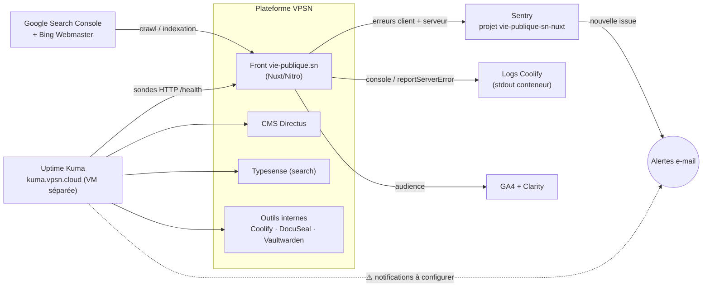

# Monitoring — vue d'ensemble

> Qui surveille quoi, et par où sortent les alertes. Détail par outil :
> [`sentry.md`](./sentry.md) (erreurs applicatives) · [`supervision-infra.md`](./supervision-infra.md)
> (plan Prometheus/Grafana, non déployé) · [`README.md`](./README.md) (topologie infra).

## Schéma

## Lecture

| Dimension               | Outil                                     | Alerte                                     |
| ----------------------- | ----------------------------------------- | ------------------------------------------ |
| **Erreurs applicatives** | Sentry ([`sentry.md`](./sentry.md))       | e-mail sur nouvelle issue ✅ (validé 07/26) |
| **Disponibilité**        | Uptime Kuma (<https://kuma.vpsn.cloud>)   | ⚠️ canal de notification à configurer      |
| **Logs runtime**         | Coolify (stdout du conteneur)             | consultation manuelle                      |
| **Audience**             | GA4 + Microsoft Clarity                   | —                                          |
| **SEO / indexation**     | Google Search Console + Bing Webmaster    | e-mails GSC/Bing                           |

## Points d'attention

- **Kuma tourne sur une VM séparée de la prod** — c'est voulu (il voit la prod tomber).
  Mais tant qu'aucune **notification** (e-mail/Telegram) n'y est configurée, un site down
  ne prévient personne : le dashboard n'alerte que si on le regarde.
- La stack **Prometheus/Grafana** ([`supervision-infra.md`](./supervision-infra.md)) reste une
  piste d'évolution non déployée — utile seulement si on veut des métriques (CPU/RAM, taux de
  5xx, latence) en plus du up/down de Kuma.
- Côté serveur applicatif, les erreurs « dégradées proprement » ne sont visibles que si le
  code appelle `reportServerError()` (cf. [`sentry.md`](./sentry.md) §4 et CLAUDE.md).
