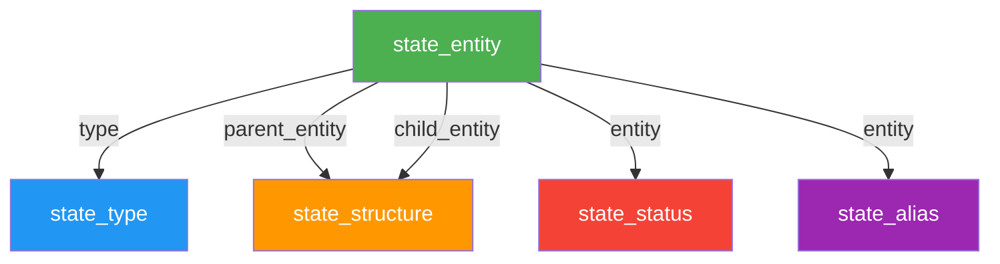

# 📋 Schéma complet des collections

## 1️⃣ state_entity (Entités de l'État)

| Champ | Type | Contraintes | Description |
|-------|------|-------------|-------------|
| `id` | UUID | Primary key | Identifiant unique |
| `name` | String | Required | Nom officiel (ex: "Ministère de la Justice") |
| `slug` | String | Required | Slug technique (peut doubler, ex: "ministere-justice") |
| `public_slug` | String | Nullable, Unique | Slug SEO pour URL publique (ex: "ministere-justice") |
| `has_public_page` | Boolean | Required | Si l'entité a une fiche publique |
| `type` | M2O → state_type | Required | Type d'entité (ministry, agency, etc.) |
| `role` | String | Required | institution ou structure |
| `business_key` | String | Required, Unique | Identifiant stable (ex: "artp", "ministere-justice") |
| `last_decree_reference` | String | Nullable | Dernier décret (ex: "2024", "2025") |
| `date_created` | Timestamp | Auto | Date de création |
| `date_updated` | Timestamp | Auto | Date de modification |

---

## 2️⃣ state_type (Types d'entités)

| Champ | Type | Contraintes | Description |
|-------|------|-------------|-------------|
| `id` | UUID | Primary key | Identifiant unique |
| `code` | String | Required, Unique | Code technique (ex: "ministry", "agency") |
| `name` | String | Required | Nom d'affichage (ex: "Ministère", "Agence") |
| `description` | Text | Nullable | Description du type |
| `has_public_page` | Boolean | Required | Si ce type a des fiches publiques |

---

## 3️⃣ state_structure (Relations parent-enfant)

| Champ | Type | Contraintes | Description |
|-------|------|-------------|-------------|
| `id` | UUID | Primary key | Identifiant unique |
| `parent_entity` | M2O → state_entity | Required | Entité parente |
| `child_entity` | M2O → state_entity | Required | Entité enfant |
| `date_valid_from` | Date | Required | Date de début de validité (YYYY-MM-DD) |
| `date_valid_to` | Date | Nullable | Date de fin de validité (null = actif) |
| `decree_reference` | String | Required | Référence du décret (ex: "2024", "2025") |
| `date_created` | Timestamp | Auto | Date de création |

---

## 4️⃣ state_status (Statuts des entités)

| Champ | Type | Contraintes | Description |
|-------|------|-------------|-------------|
| `id` | UUID | Primary key | Identifiant unique |
| `entity` | M2O → state_entity | Required | Entité concernée |
| `status` | String | Required | `active` ou `deleted` |
| `start_date` | Date | Nullable | Date de début (YYYY-MM-DD) |
| `end_date` | Date | Nullable | Date de fin (YYYY-MM-DD) |
| `decree_reference` | String | Required | Référence du décret (ex: "2024", "2025") |
| `date_created` | Timestamp | Auto | Date de création |

---

## 5️⃣ state_alias (Alias et anciens noms)

| Champ | Type | Contraintes | Description |
|-------|------|-------------|-------------|
| `id` | UUID | Primary key | Identifiant unique |
| `entity` | M2O → state_entity | Required | Entité concernée |
| `alias` | String | Required | Alias ou ancien nom |
| `date_valid_from` | Date | Nullable | Date de début de validité |
| `date_valid_to` | Date | Nullable | Date de fin de validité |
| `note` | Text | Nullable | Note explicative (ex: "Ancien nom officiel") |
| `date_created` | Timestamp | Auto | Date de création |

---

## 📊 Relations entre collections



### Cardinalités

- **state_entity** → **state_type** : Many-to-One (plusieurs entités peuvent avoir le même type)
- **state_structure** : Table de jonction pour hiérarchie (parent ← enfant)
- **state_status** : One-to-Many (une entité peut avoir plusieurs statuts historiques)
- **state_alias** : One-to-Many (une entité peut avoir plusieurs alias)

---

## 🔍 Exemples d'utilisation

### Exemple 1 : Ministère de la Justice

#### `state_entity`
```json
{
  "id": "uuid-justice",
  "name": "Ministère de la Justice",
  "slug": "ministere-justice",
  "public_slug": "ministere-justice",
  "has_public_page": true,
  "type": "ministry",
  "role": "institution",
  "business_key": "ministere-justice",
  "last_decree_reference": "2024"
}
```

#### `state_structure` (Direction des Affaires civiles comme enfant)
```json
{
  "parent_entity": "uuid-justice",
  "child_entity": "uuid-affaires-civiles",
  "date_valid_from": "2024-01-01",
  "date_valid_to": null,
  "decree_reference": "2024"
}
```

#### `state_alias` (Ancien nom)
```json
{
  "entity": "uuid-justice",
  "alias": "Ministère de la Justice et Garde des Sceaux",
  "date_valid_from": "2020-01-01",
  "date_valid_to": "2023-12-31",
  "note": "Ancien nom officiel avant réforme 2024"
}
```

---

## ⚙️ Règles de gestion

### 1. Unicité des `business_key`
- Chaque entité doit avoir un `business_key` unique
- Utilisé comme identifiant stable pour les intégrations
- Ne doit jamais changer même si le nom officiel change

### 2. Gestion des slugs
- `slug` : Technique, peut être dupliqué entre entités
- `public_slug` : SEO-friendly, **doit être unique** pour les entités publiques
- `has_public_page` : Détermine si l'entité a une URL publique

### 3. Hiérarchie temporelle
- `state_structure` permet de gérer les changements d'organigramme
- `date_valid_from` / `date_valid_to` : Période de validité
- `decree_reference` : Traçabilité réglementaire

### 4. Statuts
- `active` : Entité en activité
- `deleted` : Entité supprimée/fusionnée
- Historique conservé via `start_date` / `end_date`

### 5. Alias
- Permet de retrouver les entités par anciens noms
- Utile pour recherche et SEO
- `note` explique le contexte historique

---

## 🚀 Cas d'usage

### Recherche d'une entité par ancien nom
```sql
SELECT e.*
FROM state_entity e
JOIN state_alias a ON a.entity = e.id
WHERE a.alias ILIKE '%Justice%'
```

### Organigramme actuel d'un ministère
```sql
SELECT
  parent.name AS ministere,
  child.name AS direction
FROM state_structure s
JOIN state_entity parent ON s.parent_entity = parent.id
JOIN state_entity child ON s.child_entity = child.id
WHERE parent.business_key = 'ministere-justice'
  AND s.date_valid_to IS NULL  -- Relations actives uniquement
```

### Entités actives par type
```sql
SELECT e.*, t.name AS type_name
FROM state_entity e
JOIN state_type t ON e.type = t.id
JOIN state_status st ON st.entity = e.id
WHERE st.status = 'active'
  AND (st.end_date IS NULL OR st.end_date > CURRENT_DATE)
ORDER BY t.name, e.name
```

---

## 📝 Notes techniques

### Contraintes d'intégrité
- Empêcher les cycles dans `state_structure` (A → B → A)
- Vérifier qu'une entité active a au moins un statut `active`
- Valider les dates : `date_valid_from` < `date_valid_to`

### Indexes recommandés
```sql
-- Performance recherche
CREATE INDEX idx_entity_business_key ON state_entity(business_key);
CREATE INDEX idx_entity_slug ON state_entity(slug);
CREATE INDEX idx_entity_public_slug ON state_entity(public_slug);

-- Performance relations
CREATE INDEX idx_structure_parent ON state_structure(parent_entity);
CREATE INDEX idx_structure_child ON state_structure(child_entity);
CREATE INDEX idx_status_entity ON state_status(entity);
CREATE INDEX idx_alias_entity ON state_alias(entity);

-- Performance recherche temporelle
CREATE INDEX idx_structure_dates ON state_structure(date_valid_from, date_valid_to);
CREATE INDEX idx_status_dates ON state_status(start_date, end_date);
```
